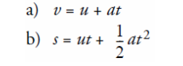
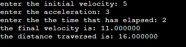

### Description

calculating the final velocity, v, and distance traversed by :

- asking the user to enter the initial velocity and acceleration
of an object, and the time that has elapsed.

- then using the following equations

### The output

