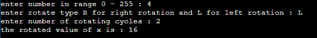

### Description

a program to perform a generic rotate right and rotate left expression using bit masking.

The code shall ask the user to enter the following :

- An 8 bit number x
- Number of rotate cycles n
- rotate option o (left or right rotation).

The software shall print the rotate value of x, n times based on the value of o.

### The output

