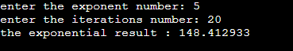

### Description

#### Exponential function using taylor series:

- Without using functions, you are required to write a code to calculate the exponential function using Taylor series. 
- Your program is required to ask the user to enter the exponent and the number of iteration and then print the exponential result.

### The output

