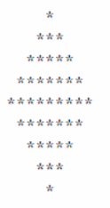

### Description

Write a program that prints the following diamond shape. You may use printf statements that
print either a single asterisk (*) or a single blank. Maximize your use of iteration (with nested for
statements) and minimize the number of printf statements.

### The output

