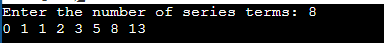

### Description

The Fibonacci series 0, 1, 1, 2, 3, 5, 8, 13, 21, ... begins with the terms 0 and 1 and has the
property that each succeeding term is the sum of the two preceding terms.

Write a code that print the number of series terms after reading it from a user input.

### The output

